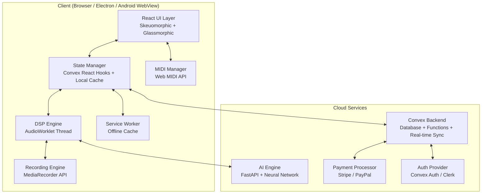
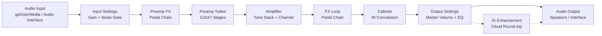
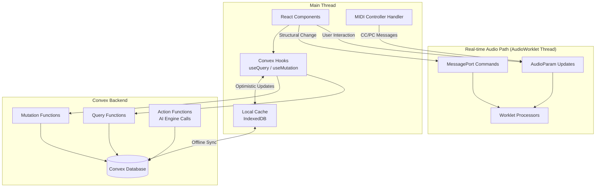
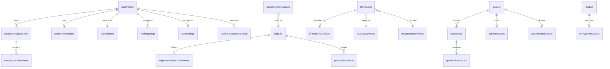

# Design Document: Amp Simulation Platform

## Overview

The Amp Simulation Platform is a cross-platform guitar amplifier and effects simulation application built on Next.js with a client-side DSP engine powered by the Web Audio API's AudioWorklet interface. The system uses Convex as the reactive backend for real-time data sync, authentication, and subscription management, while leveraging Service Workers and local storage for offline-first operation.

The architecture separates concerns into three primary layers:

1. **DSP Layer** — Client-side audio processing via AudioWorklet running on a dedicated audio thread, achieving sub-15ms latency by processing 128-sample frames at 44.1–96kHz sample rates.
2. **Application Layer** — Next.js App Router with React components for the skeuomorphic/glassmorphic UI, state management via Convex reactive queries, and platform abstraction for Web/PWA/Electron/Android targets.
3. **Cloud Layer** — Convex backend for data persistence, real-time sync, and subscription management; a separate FastAPI service hosts the AI Neural Network engine for Next Gen tier processing.

Key architectural decisions:
- **AudioWorklet over ScriptProcessorNode**: AudioWorklet runs on a separate real-time audio thread with a fixed 128-sample block size (~2.9ms at 44.1kHz), enabling deterministic low-latency processing. ScriptProcessorNode is deprecated and runs on the main thread.
- **Convex over raw PostgreSQL**: Convex provides end-to-end TypeScript type safety, real-time subscriptions via WebSockets, and built-in optimistic updates — eliminating the need for a separate API layer for most operations. For offline sync, Convex's optimistic mutations combined with a local IndexedDB cache provide CRDT-like conflict resolution.
- **Signal chain as a directed acyclic graph (DAG)**: Each processing stage is an AudioWorkletNode connected in sequence. Reordering FX pedals within a stage reconnects nodes without tearing down the entire graph, enabling glitch-free parameter changes within the 10ms requirement.
- **Electron shares the same codebase**: The Electron app loads the Next.js app via `BrowserWindow.loadURL`, with native Node.js bridges for file system access (recording), MIDI device enumeration, and audio interface selection. The Web Audio API works identically in Electron's Chromium runtime.



## Architecture

### System Architecture

The platform follows a client-heavy architecture where all audio processing happens on the user's device. The cloud is used only for data persistence, sync, authentication, payments, and AI enhancement.

#### Audio Processing Pipeline

The DSP Engine is built entirely on the Web Audio API. Each stage of the signal chain maps to one or more `AudioWorkletNode` instances connected in series:



Each node processes audio in 128-sample blocks on the AudioWorklet thread. Parameter changes are communicated via `AudioParam` (for sample-accurate automation) or `MessagePort` (for structural changes like pedal reordering).

**Latency budget** (at 44.1kHz, 128-sample blocks):
- Input buffer: ~2.9ms
- DSP processing (all stages): ~1–3ms
- Output buffer: ~2.9ms
- Audio interface round-trip: ~5–6ms
- **Total: ~12–15ms** (within the 15ms requirement)

#### Data Flow Architecture



### Cross-Platform Strategy

| Target | Runtime | Audio Engine | Distribution |
|--------|---------|-------------|-------------|
| Web | Browser (Chrome, Firefox, Safari, Edge) | Web Audio API + AudioWorklet | Vercel deployment |
| PWA | Browser + Service Worker | Web Audio API + AudioWorklet | Same as web, installable |
| Electron (Mac) | Chromium + Node.js | Web Audio API + AudioWorklet | DMG / App Store |
| Electron (Windows) | Chromium + Node.js | Web Audio API + AudioWorklet | NSIS installer / MS Store |
| Android | WebView (Capacitor/TWA) | Web Audio API + AudioWorklet | Google Play Store |

The Electron app wraps the Next.js build with additional Node.js bridges:
- `electron-audio-bridge`: Enumerates native audio devices, sets buffer sizes
- `electron-midi-bridge`: Supplements Web MIDI API with native USB/Bluetooth MIDI
- `electron-fs-bridge`: Provides native file save dialogs for recordings


## Components and Interfaces

### 1. DSP Engine (`src/dsp/`)

The DSP Engine is the core audio processing system. It runs entirely on the AudioWorklet thread.

#### AudioWorklet Processors

Each signal chain stage is implemented as a custom `AudioWorkletProcessor`:

```typescript
// src/dsp/processors/preamp-tube-processor.ts
interface PreampTubeParams {
  gainStages: number;       // 1–N (model-dependent)
  stageGain: number[];      // Per-stage gain values from Preamp_Tone_Values
  frequencyResponse: number[][]; // Per-stage EQ curves
}

class PreampTubeProcessor extends AudioWorkletProcessor {
  process(inputs: Float32Array[][], outputs: Float32Array[][], parameters: Record<string, Float32Array>): boolean
}
```

**Processor inventory:**
| Processor | Purpose | Key Parameters |
|-----------|---------|---------------|
| `InputSettingsProcessor` | Input gain, noise gate | gain, gateThreshold, gateRelease |
| `FxPedalProcessor` | Generic FX pedal DSP | circuitType, knobValues[], enabled |
| `PreampTubeProcessor` | 12AX7 tube gain staging | gainStages, stageGain[], frequencyResponse |
| `AmplifierProcessor` | Tone stack + channel | bass, mid, treble, presence, resonance, channel |
| `PowerAmpProcessor` | Power tube simulation | tubeType, masterVolume, bias, sag, voltage |
| `CabinetProcessor` | IR convolution | irBuffer, micType, micPosition, micDistance |
| `OutputSettingsProcessor` | Master volume, final EQ | masterVolume, outputGain |

#### Signal Chain Manager

```typescript
// src/dsp/signal-chain-manager.ts
interface SignalChainManager {
  // Lifecycle
  initialize(audioContext: AudioContext): Promise<void>;
  dispose(): void;

  // Chain configuration
  loadSignalChain(config: SavedSignalChain): Promise<void>;
  getSignalChainState(): SignalChainState;

  // Stage manipulation
  setAmpModel(modelId: string): Promise<void>;
  setPreampTubeCount(count: number): void;
  setPowerAmpTubeType(tubeType: PowerAmpTubeType): void;
  setCabinet(cabinetId: string): Promise<void>;

  // FX pedal management
  addPedal(stageId: 'preamp' | 'fxloop', pedalId: string, position: number): void;
  removePedal(stageId: 'preamp' | 'fxloop', position: number): void;
  reorderPedals(stageId: 'preamp' | 'fxloop', newOrder: string[]): void;
  setPedalEnabled(stageId: 'preamp' | 'fxloop', position: number, enabled: boolean): void;

  // Parameter control
  setParameter(nodeId: string, paramName: string, value: number): void;
  getParameter(nodeId: string, paramName: string): number;

  // Microphone
  setMicPosition(x: number, y: number, z: number): void;
  setMicType(micType: MicType): void;
  setMicDistance(distance: number): void;
}
```

### 2. UI Components (`src/components/`)

#### Skeuomorphic Controls

```typescript
// src/components/controls/rotary-knob.tsx
interface RotaryKnobProps {
  value: number;              // Current value (normalized 0–1)
  min: number;                // Display minimum (e.g., 1)
  max: number;                // Display maximum (e.g., 10)
  label: string;              // Knob label text
  onChange: (value: number) => void;
  onContextMenu: (e: React.MouseEvent) => void;
  size?: 'sm' | 'md' | 'lg';
  style?: 'chicken-head' | 'pointer' | 'dome'; // Knob visual style
}

// src/components/controls/toggle-switch.tsx
interface ToggleSwitchProps {
  value: boolean;
  label: string;
  onChange: (value: boolean) => void;
  style?: 'rocker' | 'toggle' | 'push';
}

// src/components/controls/slider-control.tsx
interface SliderControlProps {
  value: number;
  min: number;
  max: number;
  label: string;
  orientation: 'horizontal' | 'vertical';
  onChange: (value: number) => void;
}
```

#### Amp Model Renderer

```typescript
// src/components/amp/amp-model-renderer.tsx
interface AmpModelRendererProps {
  model: AmpModel;
  parameters: AmpParameters;
  onParameterChange: (param: string, value: number) => void;
  onChannelChange: (channel: AmpChannel) => void;
  onContextMenu: (param: string, e: React.MouseEvent) => void;
}
```

Each amp model has a dedicated layout configuration defining knob positions, colors, typography, and panel artwork. The renderer reads this configuration and places `RotaryKnob`, `ToggleSwitch`, and channel selector components accordingly.

#### FX Pedal Board

```typescript
// src/components/fx/pedal-board.tsx
interface PedalBoardProps {
  stage: 'preamp' | 'fxloop';
  pedals: FxPedalInstance[];
  onReorder: (newOrder: string[]) => void;
  onPedalToggle: (pedalId: string, enabled: boolean) => void;
  onPedalParameterChange: (pedalId: string, param: string, value: number) => void;
  onAddPedal: () => void;
  onRemovePedal: (pedalId: string) => void;
}
```

Drag-and-drop reordering uses `@dnd-kit/core` for accessible, touch-friendly sorting. Each pedal renders as a skeuomorphic card with its brand-renamed identity, knobs, and footswitch.

#### Context Menu System

```typescript
// src/components/ui/parameter-context-menu.tsx
interface ParameterContextMenuProps {
  targetType: 'knob' | 'slider' | 'switch' | 'pedal' | 'amp';
  paramName: string;
  currentValue: number;
  min: number;
  max: number;
  defaultValue: number;
  onSetDefault: () => void;
  onEnterValue: (value: number) => void;
  onCopyValue: () => void;
  onPasteValue: (value: number) => void;
}
```

### 3. Convex Backend (`convex/`)

#### Schema Definition

```typescript
// convex/schema.ts
import { defineSchema, defineTable } from "convex/server";
import { v } from "convex/values";

export default defineSchema({
  // Amp models and tone data
  ampList: defineTable({ ... }),
  ampManufacturerToneValues: defineTable({ ... }),
  preampSettings: defineTable({ ... }),
  preampToneValues: defineTable({ ... }),
  powerAmpSettings: defineTable({ ... }),
  powerAmpToneValues: defineTable({ ... }),

  // FX pedals
  fxPedalList: defineTable({ ... }),
  fxPedalSettings: defineTable({ ... }),
  fxPedalCircuitValues: defineTable({ ... }),
  fxCategoryValues: defineTable({ ... }),
  fxManufacturerValues: defineTable({ ... }),

  // Cabinets and speakers
  cabList: defineTable({ ... }),
  speakerList: defineTable({ ... }),
  cabToneValues: defineTable({ ... }),
  speakerToneValues: defineTable({ ... }),
  cabCombinedValues: defineTable({ ... }),

  // Microphones
  micList: defineTable({ ... }),
  micTypeToneValues: defineTable({ ... }),

  // User data
  userProfiles: defineTable({ ... }),
  userBioInformation: defineTable({ ... }),
  savedUserSignalChain: defineTable({ ... }),
  userSignalChainValues: defineTable({ ... }),

  // Subscriptions
  subscriptions: defineTable({ ... }),
});
```

#### Convex Functions

```typescript
// convex/signalChains.ts — Query and mutation functions
export const getUserSignalChains = query({
  args: { userId: v.id("userProfiles") },
  handler: async (ctx, args) => { /* ... */ }
});

export const saveSignalChain = mutation({
  args: { name: v.string(), config: v.object({ /* ... */ }) },
  handler: async (ctx, args) => { /* ... */ }
});

export const loadSignalChain = query({
  args: { chainId: v.id("savedUserSignalChain") },
  handler: async (ctx, args) => { /* ... */ }
});

// convex/subscriptions.ts — Tier enforcement
export const getUserTier = query({
  args: {},
  handler: async (ctx) => { /* ... */ }
});

export const checkContentAccess = query({
  args: { contentType: v.string(), contentId: v.string() },
  handler: async (ctx, args) => { /* ... */ }
});
```

### 4. AI Engine Interface (`src/services/ai-engine.ts`)

```typescript
interface AIEngineService {
  // Connection management
  connect(): Promise<void>;
  disconnect(): void;
  getStatus(): AIEngineStatus;

  // Audio processing
  processAudio(dspOutput: Float32Array, sampleRate: number): Promise<Float32Array>;
  setBlendLevel(level: number): void; // 0.0 (DSP only) to 1.0 (full AI)

  // Status
  getLatency(): number;
  getModelVersion(): string;
}

interface AIEngineStatus {
  connected: boolean;
  latency: number;
  modelVersion: string;
  connectionQuality: 'excellent' | 'good' | 'poor' | 'disconnected';
}
```

The AI Engine communicates via WebSocket for streaming audio data to the FastAPI backend. When latency exceeds 50ms, the client automatically notifies the user and offers to disable AI enhancement.

### 5. MIDI Manager (`src/services/midi-manager.ts`)

```typescript
interface MIDIManager {
  // Device discovery
  initialize(): Promise<void>;
  getDevices(): MIDIDevice[];
  selectDevice(deviceId: string): void;

  // Mapping
  createMapping(midiMessage: MIDIMessage, target: ParameterTarget): void;
  deleteMapping(mappingId: string): void;
  getMappings(): MIDIMapping[];

  // Quick-map mode
  startQuickMap(target: ParameterTarget): void;
  cancelQuickMap(): void;

  // Events
  onMessage: (callback: (message: MIDIMessage) => void) => void;
}

interface MIDIMapping {
  id: string;
  channel: number;
  type: 'cc' | 'program_change';
  number: number;
  target: ParameterTarget;
}

type ParameterTarget =
  | { type: 'amp_channel'; channel: AmpChannel }
  | { type: 'pedal_toggle'; stageId: string; pedalId: string }
  | { type: 'pedal_boost'; stageId: string; pedalId: string }
  | { type: 'parameter'; nodeId: string; paramName: string };
```

### 6. Recording Engine (`src/services/recording-engine.ts`)

```typescript
interface RecordingEngine {
  startRecording(options: RecordingOptions): void;
  stopRecording(): Promise<RecordingResult>;
  isRecording(): boolean;
  getElapsedTime(): number;
  getWaveformData(): Float32Array; // For visualization
}

interface RecordingOptions {
  format: 'wav' | 'mp3' | 'flac';
  sampleRate: 44100 | 48000 | 96000;
  bitDepth: 16 | 24 | 32;
  outputPath?: string; // Electron only
}

interface RecordingResult {
  blob: Blob;
  duration: number;
  format: string;
  sampleRate: number;
  bitDepth: number;
}
```

### 7. Offline Manager (`src/services/offline-manager.ts`)

```typescript
interface OfflineManager {
  getConnectivityStatus(): 'online' | 'offline';
  onStatusChange: (callback: (status: 'online' | 'offline') => void) => void;

  // Local cache
  cacheSignalChain(chain: SavedSignalChain): Promise<void>;
  getCachedSignalChains(): Promise<SavedSignalChain[]>;

  // Sync
  syncPendingChanges(): Promise<SyncResult>;
  getPendingChangeCount(): number;
}
```


## Data Models

### Core Type Definitions

```typescript
// src/types/amp.ts
type AmpChannel = 'clean' | 'crunch' | 'overdrive';
type PowerAmpTubeType = 'KT88' | '6L6' | 'EL34' | 'EL84' | '12BH7' | '12AU7';
type MicType = 'condenser' | 'ribbon' | 'dynamic';
type MicPreset = 'center' | 'middle' | 'outside';
type SubscriptionTier = 'free' | 'classic' | 'next_gen';

interface AmpModel {
  id: string;
  name: string;                    // e.g., "Winston CHL"
  originalBrand: string;           // Internal reference only
  brandRename: string;             // e.g., "Winston"
  channels: AmpChannel[];
  preampStageCount: number;        // Max 12AX7 stages
  powerAmpTubeType: PowerAmpTubeType;
  controls: AmpControlDefinition[];
  toggleSwitches: ToggleSwitchDefinition[];
  visualConfig: AmpVisualConfig;
}

interface AmpParameters {
  preampGain: number;    // 1–10
  volume: number;        // 1–10
  masterVolume: number;  // 1–10
  masterGain: number;    // 1–10
  bass: number;          // 1–10
  middle: number;        // 1–10
  treble: number;        // 1–10
  tone: number;          // 1–10
  presence: number;      // 1–10
  resonance: number;     // 1–10
  channel: AmpChannel;
  toggles: Record<string, boolean>; // toneShift, deep, midBoost, etc.
}

interface AmpControlDefinition {
  name: string;
  paramKey: keyof AmpParameters;
  min: number;
  max: number;
  defaultValue: number;
  step: number;
}

interface ToggleSwitchDefinition {
  name: string;
  paramKey: string;
  defaultValue: boolean;
  applicableToModel: boolean;
}

interface AmpVisualConfig {
  panelColor: string;
  knobStyle: 'chicken-head' | 'pointer' | 'dome';
  fontFamily: string;
  logoSvgPath: string;
  layoutGrid: KnobPosition[];
}

interface KnobPosition {
  paramKey: string;
  x: number;  // Percentage position
  y: number;
  size: 'sm' | 'md' | 'lg';
}
```

```typescript
// src/types/fx.ts
type FxCategory = 'overdrive' | 'distortion' | 'delay' | 'modulation' | 'compression' | 'eq' | 'gate' | 'multi';
type FxBrandRename = 'MAC' | 'KING' | 'Manhattan' | 'TOKYO';

interface FxPedalDefinition {
  id: string;
  name: string;                    // e.g., "Super Comp"
  brand: FxBrandRename;
  originalBrand: string;           // Internal reference
  category: FxCategory;
  controls: FxControlDefinition[];
  circuitType: string;             // Reference to circuit model
  visualConfig: FxPedalVisualConfig;
  tierRequired: SubscriptionTier;  // 'free' for free-tier pedals
}

interface FxPedalInstance {
  definitionId: string;
  instanceId: string;
  enabled: boolean;
  parameters: Record<string, number>;
  position: number;                // Order in chain
}

interface FxControlDefinition {
  name: string;
  paramKey: string;
  type: 'knob' | 'switch' | 'slider';
  min: number;
  max: number;
  defaultValue: number;
  step: number;
}

interface FxPedalVisualConfig {
  bodyColor: string;
  knobStyle: string;
  labelFont: string;
  logoSvgPath: string;
  width: number;
  height: number;
}
```

```typescript
// src/types/cabinet.ts
interface Cabinet {
  id: string;
  name: string;                    // e.g., "Winston 4x12"
  speakerConfig: string;           // e.g., "4x12"
  speakers: Speaker[];
  irData: Float32Array;            // Combined IR buffer
  visualConfig: CabinetVisualConfig;
}

interface Speaker {
  id: string;
  name: string;
  frequencyResponse: number[];     // From Speaker_Tone_Values
  powerRating: number;
}

interface MicPosition {
  x: number;  // -1 to 1 (left to right)
  y: number;  // -1 to 1 (bottom to top)
  z: number;  // 0 to 1 (distance from cone)
}

interface MicConfiguration {
  type: MicType;
  position: MicPosition;
  distance: number;                // 0 to 1 (close to far)
  preset?: MicPreset;
}
```

```typescript
// src/types/signal-chain.ts
interface SignalChainState {
  inputSettings: InputSettings;
  preampFx: FxPedalInstance[];
  preampTubes: PreampTubeConfig;
  amplifier: AmplifierConfig;
  fxLoop: FxPedalInstance[];
  cabinet: CabinetConfig;
  outputSettings: OutputSettings;
}

interface InputSettings {
  inputGain: number;       // 0–1
  noiseGateEnabled: boolean;
  noiseGateThreshold: number;
  noiseGateRelease: number;
}

interface PreampTubeConfig {
  tubeCount: number;       // 1–N
  stageGains: number[];    // Per-stage gain
}

interface AmplifierConfig {
  modelId: string;
  parameters: AmpParameters;
}

interface CabinetConfig {
  cabinetId: string;
  mic: MicConfiguration;
}

interface OutputSettings {
  masterVolume: number;    // 0–1
  outputGain: number;      // 0–1
}

interface SavedSignalChain {
  id: string;
  userId: string;
  name: string;
  config: SignalChainState;
  createdAt: number;
  updatedAt: number;
}
```

```typescript
// src/types/user.ts
interface UserProfile {
  id: string;
  email: string;
  displayName: string;
  tier: SubscriptionTier;
  createdAt: number;
  lastLoginAt: number;
}

interface Subscription {
  id: string;
  userId: string;
  tier: SubscriptionTier;
  status: 'active' | 'past_due' | 'cancelled';
  currentPeriodEnd: number;
  paymentMethod: 'credit_card' | 'paypal';
}
```

```typescript
// src/types/tone-stack.ts
// Serialization types for round-trip property
interface ToneStackJSON {
  version: number;
  ampModelId: string;
  parameters: {
    preampGain: number;
    volume: number;
    masterVolume: number;
    masterGain: number;
    bass: number;
    middle: number;
    treble: number;
    tone: number;
    presence: number;
    resonance: number;
  };
  channel: AmpChannel;
  toggles: Record<string, boolean>;
}

interface FxChainJSON {
  version: number;
  pedals: Array<{
    definitionId: string;
    enabled: boolean;
    parameters: Record<string, number>;
    position: number;
  }>;
}

// Serialization functions
function serializeToneStack(params: AmpParameters, modelId: string): ToneStackJSON;
function deserializeToneStack(json: ToneStackJSON): { modelId: string; params: AmpParameters };
function serializeFxChain(pedals: FxPedalInstance[]): FxChainJSON;
function deserializeFxChain(json: FxChainJSON): FxPedalInstance[];
```

### Convex Database Schema (Detailed)

```typescript
// convex/schema.ts
import { defineSchema, defineTable } from "convex/server";
import { v } from "convex/values";

export default defineSchema({
  // ── Amplifier Tables ──
  ampList: defineTable({
    name: v.string(),
    brandRename: v.string(),
    channels: v.array(v.string()),
    preampStageCount: v.number(),
    powerAmpTubeType: v.string(),
    controls: v.array(v.object({
      name: v.string(),
      paramKey: v.string(),
      min: v.number(),
      max: v.number(),
      defaultValue: v.number(),
    })),
    toggleSwitches: v.array(v.object({
      name: v.string(),
      paramKey: v.string(),
      defaultValue: v.boolean(),
    })),
    visualConfig: v.any(),
  }).index("by_name", ["name"]),

  ampManufacturerToneValues: defineTable({
    ampId: v.id("ampList"),
    bass: v.object({ frequency: v.number(), gain: v.number(), q: v.number() }),
    middle: v.object({ frequency: v.number(), gain: v.number(), q: v.number() }),
    treble: v.object({ frequency: v.number(), gain: v.number(), q: v.number() }),
    presence: v.object({ frequency: v.number(), gain: v.number(), q: v.number() }),
    resonance: v.object({ frequency: v.number(), gain: v.number(), q: v.number() }),
  }).index("by_amp", ["ampId"]),

  preampToneValues: defineTable({
    ampId: v.id("ampList"),
    stageIndex: v.number(),
    gain: v.number(),
    frequencyResponse: v.array(v.number()),
    harmonicContent: v.array(v.number()),
  }).index("by_amp_stage", ["ampId", "stageIndex"]),

  powerAmpToneValues: defineTable({
    tubeType: v.string(),
    masterVolumeResponse: v.array(v.number()),
    biasDefault: v.number(),
    sagCoefficient: v.number(),
    voltageDefault: v.number(),
    compressionCurve: v.array(v.number()),
    dynamicRange: v.object({ min: v.number(), max: v.number() }),
  }).index("by_tube_type", ["tubeType"]),

  // ── FX Pedal Tables ──
  fxPedalList: defineTable({
    name: v.string(),
    brand: v.string(),
    category: v.string(),
    controls: v.array(v.object({
      name: v.string(),
      paramKey: v.string(),
      type: v.string(),
      min: v.number(),
      max: v.number(),
      defaultValue: v.number(),
    })),
    tierRequired: v.string(),
    visualConfig: v.any(),
  }).index("by_brand", ["brand"])
    .index("by_category", ["category"]),

  fxPedalCircuitValues: defineTable({
    pedalId: v.id("fxPedalList"),
    circuitType: v.string(),
    componentValues: v.any(),
    transferFunction: v.array(v.number()),
  }).index("by_pedal", ["pedalId"]),

  fxCategoryValues: defineTable({
    name: v.string(),
    displayOrder: v.number(),
  }),

  fxManufacturerValues: defineTable({
    originalName: v.string(),
    brandRename: v.string(),
    logoSvgPath: v.string(),
  }),

  // ── Cabinet Tables ──
  cabList: defineTable({
    name: v.string(),
    speakerConfig: v.string(),
    speakerIds: v.array(v.id("speakerList")),
    visualConfig: v.any(),
  }).index("by_name", ["name"]),

  speakerList: defineTable({
    name: v.string(),
    frequencyResponse: v.array(v.number()),
    powerRating: v.number(),
  }),

  cabToneValues: defineTable({
    cabId: v.id("cabList"),
    depth: v.number(),
    dimension: v.number(),
    airSimulation: v.array(v.number()),
  }).index("by_cab", ["cabId"]),

  speakerToneValues: defineTable({
    speakerId: v.id("speakerList"),
    frequencySpectrum: v.array(v.number()),
    impedanceCurve: v.array(v.number()),
  }).index("by_speaker", ["speakerId"]),

  cabCombinedValues: defineTable({
    cabId: v.id("cabList"),
    irData: v.bytes(),
    sampleRate: v.number(),
  }).index("by_cab", ["cabId"]),

  // ── Microphone Tables ──
  micList: defineTable({
    name: v.string(),
    type: v.string(),
  }),

  micTypeToneValues: defineTable({
    micId: v.id("micList"),
    frequencyResponse: v.array(v.number()),
    polarPattern: v.string(),
    sensitivityDb: v.number(),
  }).index("by_mic", ["micId"]),

  // ── User Tables ──
  userProfiles: defineTable({
    email: v.string(),
    displayName: v.string(),
    passwordHash: v.string(),
    tier: v.string(),
    createdAt: v.number(),
    lastLoginAt: v.number(),
    failedLoginAttempts: v.number(),
    lockedUntil: v.optional(v.number()),
  }).index("by_email", ["email"]),

  userBioInformation: defineTable({
    userId: v.id("userProfiles"),
    firstName: v.optional(v.string()),
    lastName: v.optional(v.string()),
    avatarUrl: v.optional(v.string()),
    bio: v.optional(v.string()),
  }).index("by_user", ["userId"]),

  savedUserSignalChain: defineTable({
    userId: v.id("userProfiles"),
    name: v.string(),
    config: v.any(),
    createdAt: v.number(),
    updatedAt: v.number(),
  }).index("by_user", ["userId"])
    .index("by_user_name", ["userId", "name"]),

  userSignalChainValues: defineTable({
    chainId: v.id("savedUserSignalChain"),
    parameterKey: v.string(),
    parameterValue: v.any(),
  }).index("by_chain", ["chainId"]),

  // ── Subscription Tables ──
  subscriptions: defineTable({
    userId: v.id("userProfiles"),
    tier: v.string(),
    status: v.string(),
    stripeCustomerId: v.optional(v.string()),
    stripeSubscriptionId: v.optional(v.string()),
    currentPeriodEnd: v.number(),
    createdAt: v.number(),
  }).index("by_user", ["userId"]),

  // ── Real-Time Tables (for session state) ──
  realTimeUserSignalChain: defineTable({
    userId: v.id("userProfiles"),
    sessionId: v.string(),
    currentState: v.any(),
    lastUpdated: v.number(),
  }).index("by_user_session", ["userId", "sessionId"]),

  micRealTimePositionValues: defineTable({
    sessionId: v.string(),
    userId: v.id("userProfiles"),
    x: v.number(),
    y: v.number(),
    z: v.number(),
    distance: v.number(),
    lastUpdated: v.number(),
  }).index("by_session", ["sessionId"]),

  // ── MIDI Mappings ──
  midiMappings: defineTable({
    userId: v.id("userProfiles"),
    channel: v.number(),
    type: v.string(),
    number: v.number(),
    targetType: v.string(),
    targetConfig: v.any(),
  }).index("by_user", ["userId"]),

  // ── Settings ──
  userSettings: defineTable({
    userId: v.id("userProfiles"),
    audioInterfaceId: v.optional(v.string()),
    bufferSize: v.optional(v.number()),
    sampleRate: v.optional(v.number()),
    recordingFormat: v.optional(v.string()),
    recordingBitDepth: v.optional(v.number()),
    cpuPriority: v.optional(v.string()),
    gpuEnabled: v.optional(v.boolean()),
    aiBlendLevel: v.optional(v.number()),
  }).index("by_user", ["userId"]),
});
```

### Entity Relationship Diagram




## Correctness Properties

*A property is a characteristic or behavior that should hold true across all valid executions of a system — essentially, a formal statement about what the system should do. Properties serve as the bridge between human-readable specifications and machine-verifiable correctness guarantees.*

### Property 1: Subscription tier access control

*For any* user with a given subscription tier and *for any* content item (amp model, FX pedal, or cabinet), the access control function SHALL return `true` if and only if the content is within the tier's allowed set: Free tier allows exactly 1 amp, 3 pedals, 1 cabinet; Classic and Next Gen tiers allow all content.

**Validates: Requirements 1.2, 1.3, 1.4, 6.7**

### Property 2: Signal chain processing order invariant

*For any* signal chain configuration (regardless of which amp model, pedals, or cabinet are selected), the DSP engine SHALL process audio through stages in the fixed canonical order: Input Settings → Preamp FX → Preamp Tubes → Amplifier → FX Loop → Cabinet → Output Settings. The order of the connected AudioWorkletNode graph SHALL match this sequence.

**Validates: Requirements 2.1**

### Property 3: Tone stack serialization round-trip

*For any* valid ToneStack configuration (all knob values within [1, 10], valid channel selection, valid toggle states), serializing to JSON then deserializing then serializing again SHALL produce a JSON string identical to the first serialization.

**Validates: Requirements 25.1, 25.2, 25.3**

### Property 4: FX pedal chain serialization round-trip

*For any* valid FX pedal chain configuration (valid pedal definition IDs, parameters within defined ranges, valid enable/disable states, valid position ordering), serializing to JSON then deserializing then serializing again SHALL produce a JSON string identical to the first serialization.

**Validates: Requirements 25.5, 25.6, 6.6**

### Property 5: Invalid tone stack JSON error identification

*For any* malformed ToneStack JSON (missing required fields, wrong value types, or parameter values outside valid ranges), the deserialization function SHALL return an error that identifies the specific invalid field name and the expected format or range.

**Validates: Requirements 25.4**

### Property 6: Cumulative preamp gain staging

*For any* amp model and *for any* preamp tube count N (where 1 ≤ N ≤ model's maximum), the total preamp gain SHALL equal the cumulative product of individual stage gains as defined in the Preamp_Tone_Values table. Each stage SHALL independently apply its own frequency response shaping.

**Validates: Requirements 3.3, 4.2, 4.4**

### Property 7: Power amp drive compression monotonicity

*For any* power amp tube type and *for any* two drive values d1 and d2 where 0 < d1 < d2 ≤ 1.0, the compression ratio at d2 SHALL be greater than or equal to the compression ratio at d1. Additionally, for drive values above 0.7 (70%), the sag parameter SHALL be actively applied, and for drive values at or below 0.7, compression SHALL remain below a minimal threshold.

**Validates: Requirements 3.5, 5.3, 5.4**

### Property 8: Power amp tube type parameter validity

*For any* power amp tube type (KT88, 6L6, EL34, EL84, 12BH7, 12AU7) and *for any* drive level in [0, 1], the computed sag, bias, and voltage response values SHALL all be finite numbers within the tube type's specified dynamic range as stored in the Power_Amp_Tone_Values table.

**Validates: Requirements 5.2, 5.5**

### Property 9: Preamp tube count validation

*For any* amp model and *for any* integer tube count value, the platform SHALL accept the value if and only if it falls within [1, model.preampStageCount]. Values outside this range SHALL be rejected.

**Validates: Requirements 4.1**

### Property 10: Model and pedal control completeness

*For any* amp model, the model's control definition list SHALL contain entries for all required parameters: preampGain, volume, masterVolume, masterGain, bass, middle, treble, tone, presence, and resonance, each with min, max, and defaultValue defined. *For any* FX pedal, all controls defined in its FX_Pedal_Circuit_Values entry SHALL have corresponding control definitions with valid parameter ranges.

**Validates: Requirements 3.6, 6.3**

### Property 11: Brand rename consistency

*For any* FX pedal displayed in the UI, the brand name shown SHALL match the Brand_Rename mapping: MXR → MAC, BOSS → KING, Electro-Harmonix → Manhattan, Ibanez → TOKYO. No original manufacturer name SHALL appear in any user-facing string.

**Validates: Requirements 19.1**

### Property 12: Parameter value clamping

*For any* interactive control (knob, slider) with a defined range [min, max] and *for any* numeric input value v entered via the context menu's "Enter Exact Value" feature, the resulting parameter value SHALL equal `clamp(v, min, max)` — that is, `min` if v < min, `max` if v > max, and `v` otherwise.

**Validates: Requirements 26.5**

### Property 13: Context menu option completeness

*For any* knob or slider control, the right-click context menu SHALL contain at minimum: "Set to Default", "Enter Exact Value", "Copy Value", and "Paste Value". *For any* FX pedal, the right-click context menu SHALL contain at minimum: "Enable/Disable", "Remove from Chain", "Duplicate", and "View Settings".

**Validates: Requirements 14.5, 26.1, 26.2, 26.3**

### Property 14: Saved signal chain list sorting

*For any* list of saved signal chains, sorting by name SHALL produce a list in case-insensitive alphabetical order, and sorting by last modified date SHALL produce a list in reverse chronological order (most recent first). The sort SHALL be stable (equal elements preserve their relative order).

**Validates: Requirements 13.6**

### Property 15: Database referential integrity

*For any* amp model in the ampList table, there SHALL exist exactly one corresponding entry in ampManufacturerToneValues, at least one entry in preampToneValues (one per stage), and the model's powerAmpTubeType SHALL reference a valid entry in powerAmpToneValues.

**Validates: Requirements 20.4**

### Property 16: Microphone configuration determinism

*For any* microphone type (condenser, ribbon, dynamic), *for any* position (x, y, z) within [-1, 1]³, and *for any* distance in [0, 1], the cabinet output computation SHALL be deterministic — calling the blend function twice with identical inputs SHALL produce identical output buffers.

**Validates: Requirements 7.8, 8.3**


## Error Handling

### Audio Engine Errors

| Error Scenario | Detection | Recovery | User Notification |
|---|---|---|---|
| AudioWorklet fails to load | `addModule()` promise rejection | Retry up to 3 times with exponential backoff; if all fail, display error page | Modal: "Audio engine failed to initialize. Please refresh." |
| Audio dropout / buffer underrun | `AudioContext.onstatechange` + silence detection | Increase buffer size by one step (128→256→512); log event | Toast: "Audio glitch detected. Buffer size adjusted." |
| DSP processing exception | `try/catch` in AudioWorkletProcessor.process() | Return silence for the current frame; log error; resume on next frame | Toast: "Audio processing error. Recovered automatically." |
| Audio interface disconnected | `navigator.mediaDevices.ondevicechange` | Pause audio processing; show reconnection dialog; resume within 2s of reconnection | Dialog: "Audio interface disconnected. Reconnect to continue." |
| Unsupported sample rate | Validation on AudioContext creation | Fall back to 44.1kHz; warn user | Toast: "Requested sample rate not supported. Using 44.1kHz." |

### AI Engine Errors

| Error Scenario | Detection | Recovery | User Notification |
|---|---|---|---|
| AI Engine unreachable | WebSocket connection failure / timeout | Fall back to DSP-only output immediately | Banner: "AI enhancement unavailable. Using Classic processing." |
| AI latency exceeds 50ms | Latency measurement on each response | Offer user option to disable AI temporarily | Dialog: "AI processing is slow ({latency}ms). Disable temporarily?" |
| AI returns error response | HTTP error status or malformed response | Log error; fall back to DSP-only; continue | Toast: "AI enhancement error. Falling back to Classic." |
| AI model update available | Version check on WebSocket reconnect | Apply new weights automatically; no user action needed | Toast: "AI model updated to v{version}." |

### Data and Sync Errors

| Error Scenario | Detection | Recovery | User Notification |
|---|---|---|---|
| Convex connection lost | WebSocket disconnect event | Queue mutations locally in IndexedDB; retry on reconnect | Status indicator: offline icon in header |
| CRDT sync conflict | Convex optimistic update rejection | Last-write-wins with timestamp; log conflict for debugging | None (transparent to user) |
| Signal chain load failure | Validation error on deserialization | Display error with invalid field; offer to load defaults | Dialog: "Could not load signal chain: {error}. Load defaults?" |
| Local storage quota exceeded | `QuotaExceededError` on IndexedDB write | Prompt user to delete old saved chains; clear oldest cached data | Dialog: "Storage full. Delete old presets to continue." |

### Authentication and Payment Errors

| Error Scenario | Detection | Recovery | User Notification |
|---|---|---|---|
| Invalid login credentials | Server validation response | Display error; increment failed attempt counter | Form error: "Invalid email or password." |
| Account locked (5 failed attempts) | `failedLoginAttempts >= 5` | Lock for 60 seconds; reset counter on successful login | Form error: "Account locked. Try again in {seconds}s." |
| Payment failure | Stripe/PayPal webhook `payment_failed` | Downgrade to Free tier within 60s; send email notification | In-app banner + email: "Payment failed. Downgraded to Free tier." |
| Subscription expired | `currentPeriodEnd < now` check | Downgrade to Free tier; preserve saved data | Dialog: "Subscription expired. Upgrade to restore access." |

### MIDI Errors

| Error Scenario | Detection | Recovery | User Notification |
|---|---|---|---|
| MIDI device not found | `navigator.requestMIDIAccess()` rejection | Display setup instructions; offer Bluetooth scan | Dialog: "No MIDI devices found. Connect a device." |
| MIDI message for unmapped control | Message received with no matching mapping | Ignore silently; log for debugging | None |
| MIDI permission denied | Browser permission API rejection | Display permission instructions | Dialog: "MIDI access denied. Enable in browser settings." |

## Testing Strategy

### Testing Framework and Tools

- **Unit tests**: Vitest (fast, TypeScript-native, compatible with Next.js)
- **Property-based tests**: [fast-check](https://github.com/dubzzz/fast-check) (TypeScript PBT library with shrinking)
- **Component tests**: React Testing Library + Vitest
- **E2E tests**: Playwright (cross-browser, supports Electron)
- **Audio tests**: Custom AudioWorklet test harness with offline AudioContext

### Property-Based Testing Configuration

Each property test uses `fast-check` with a minimum of 100 iterations. Tests are tagged with the design property they validate:

```typescript
// Example: Property 3 - Tone stack serialization round-trip
import fc from 'fast-check';
import { serializeToneStack, deserializeToneStack } from '@/dsp/serialization';

// Feature: amp-simulation-platform, Property 3: Tone stack serialization round-trip
test('tone stack serialization round-trip', () => {
  const toneStackArb = fc.record({
    preampGain: fc.integer({ min: 1, max: 10 }),
    volume: fc.integer({ min: 1, max: 10 }),
    masterVolume: fc.integer({ min: 1, max: 10 }),
    masterGain: fc.integer({ min: 1, max: 10 }),
    bass: fc.integer({ min: 1, max: 10 }),
    middle: fc.integer({ min: 1, max: 10 }),
    treble: fc.integer({ min: 1, max: 10 }),
    tone: fc.integer({ min: 1, max: 10 }),
    presence: fc.integer({ min: 1, max: 10 }),
    resonance: fc.integer({ min: 1, max: 10 }),
    channel: fc.constantFrom('clean', 'crunch', 'overdrive'),
    toggles: fc.dictionary(
      fc.constantFrom('toneShift', 'deep', 'midBoost', 'midCut', 'bright', 'diode'),
      fc.boolean()
    ),
  });

  fc.assert(
    fc.property(toneStackArb, (params) => {
      const modelId = 'test-model';
      const json1 = serializeToneStack(params, modelId);
      const { params: restored } = deserializeToneStack(json1);
      const json2 = serializeToneStack(restored, modelId);
      expect(JSON.stringify(json1)).toBe(JSON.stringify(json2));
    }),
    { numRuns: 100 }
  );
});
```

### Test Categories

#### Unit Tests (Vitest)
- Tone stack parameter validation (range checks, type checks)
- Subscription tier access control logic
- Brand rename mapping
- Signal chain state management
- Context menu option generation per control type
- Saved chain sorting logic
- MIDI mapping creation and lookup
- Parameter clamping logic

#### Property-Based Tests (fast-check)
All 16 correctness properties from the design document, each tagged:
- **Feature: amp-simulation-platform, Property 1**: Tier access control
- **Feature: amp-simulation-platform, Property 2**: Signal chain order invariant
- **Feature: amp-simulation-platform, Property 3**: Tone stack serialization round-trip
- **Feature: amp-simulation-platform, Property 4**: FX chain serialization round-trip
- **Feature: amp-simulation-platform, Property 5**: Invalid tone stack JSON error identification
- **Feature: amp-simulation-platform, Property 6**: Cumulative preamp gain staging
- **Feature: amp-simulation-platform, Property 7**: Power amp drive compression monotonicity
- **Feature: amp-simulation-platform, Property 8**: Power amp tube type parameter validity
- **Feature: amp-simulation-platform, Property 9**: Preamp tube count validation
- **Feature: amp-simulation-platform, Property 10**: Model and pedal control completeness
- **Feature: amp-simulation-platform, Property 11**: Brand rename consistency
- **Feature: amp-simulation-platform, Property 12**: Parameter value clamping
- **Feature: amp-simulation-platform, Property 13**: Context menu option completeness
- **Feature: amp-simulation-platform, Property 14**: Saved signal chain list sorting
- **Feature: amp-simulation-platform, Property 15**: Database referential integrity
- **Feature: amp-simulation-platform, Property 16**: Microphone configuration determinism

#### Integration Tests (Playwright + Custom Harness)
- Audio interface detection and selection
- AI Engine WebSocket connection and fallback
- Convex real-time sync across simulated clients
- MIDI device detection and message handling
- Recording workflow (start → record → stop → save)
- Payment webhook processing and tier changes
- Offline mode: create chain → go offline → modify → come online → verify sync

#### Performance Tests
- Audio latency measurement (target: <15ms)
- Signal chain load time (target: <500ms)
- FX pedal reorder latency (target: <10ms)
- MIDI message response time (target: <5ms)
- UI Time to Interactive (target: <3s)
- Lighthouse score (target: ≥85)

#### Visual Regression Tests
- Amp model skeuomorphic rendering at multiple viewport sizes
- FX pedal rendering with brand-renamed identities
- Responsive layout at 320px, 768px, 1024px, 1440px, 2560px
- Dark mode / glassmorphic overlay rendering
- Live performance page at touch-optimized sizes

